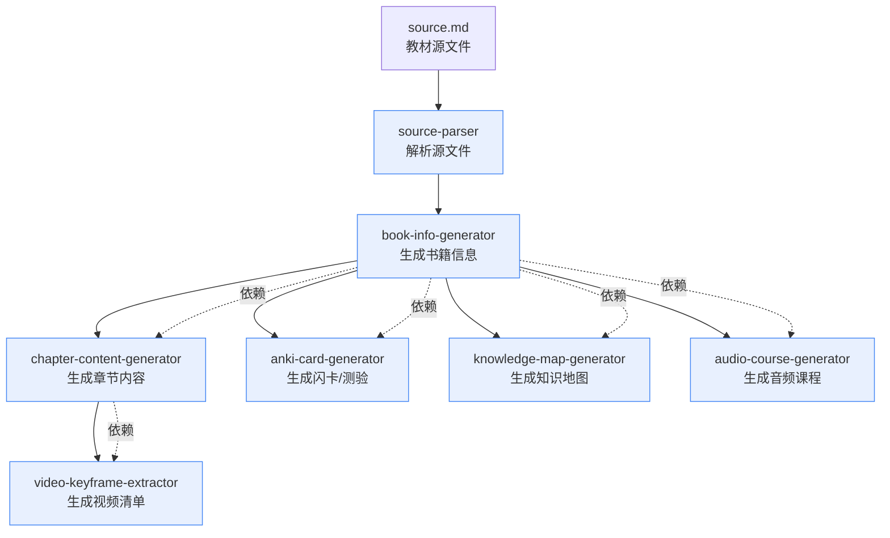

# AGENT.md — Pipeline Orchestrator 总控文档

> 数智教材2.0 核心总控 Agent 文档。输入一本书（Markdown 源文件），输出五个完整交互页面。
> 本文档面向 AI Agent，确保 Agent 拿到后即可按步骤执行，无需人工干预。

---

## 目标

输入一本书的 Markdown 源文件，经过 7 个 Skill 的顺序处理，最终输出五个完整交互页面的数据文件。

- **输入**: `books/{bookId}/source.md`（教材 Markdown 源文件）
- **输出**: `books/{bookId}/data/` 下的 6 个 TypeScript 数据文件 + 1 个可选视频数据
- **前端页面**: 5 个固定交互页面（样式/交互不变，只换内容）

---

## Skill 调用图



### 执行顺序与依赖关系

| 顺序 | Skill | 输入 | 输出 | 前置依赖 |
|------|-------|------|------|----------|
| 1 | source-parser | `books/{bookId}/source.md` | 解析后的结构化数据 | 无 |
| 2 | book-info-generator | `source.md` | `books/{bookId}/data/bookInfo.ts` | source-parser |
| 3 | chapter-content-generator | `source.md` + `bookInfo.ts` | `books/{bookId}/data/chapterContent.ts` | book-info-generator |
| 4 | anki-card-generator | `source.md` + `bookInfo.ts` | `books/{bookId}/data/anki.ts` | book-info-generator |
| 5 | knowledge-map-generator | `bookInfo.ts` | `books/{bookId}/data/knowledgeMap.ts` | book-info-generator |
| 6 | audio-course-generator | `bookInfo.ts` | `books/{bookId}/data/audioCourse.ts` | book-info-generator |
| 7 | video-keyframe-extractor | `bookInfo.ts` + `chapterContent.ts` | `books/{bookId}/data/video.ts` | chapter-content-generator |

### 关键依赖规则

1. **book-info-generator 是枢纽**: 后续 5 个 Skill 都依赖它生成的 `bookInfo.ts`
2. **chapter-content-generator 是 video 的前置**: video-keyframe-extractor 需要 `chapterContent.ts` 中的步骤数据
3. **source-parser 是隐式前置**: 所有 Skill 都读取 `source.md`，source-parser 负责提供解析工具

---

## 每个 Skill 的输入/输出/成功标准

### 1. source-parser（隐式基础组件）

- **位置**: `skills/source-parser/`（解析工具集成在 `skills/shared/markdown.ts`）
- **输入**: `books/{bookId}/source.md`
- **输出**: 结构化 Markdown 数据（标题、章节、内容块）
- **成功标准**: 能正确提取书名、模块结构、任务层级
- **关键函数**:
  - `readMarkdown(filePath)` — 读取 MD 文件
  - `extractTitle(content)` — 提取书名
  - `extractSections(content)` — 提取章节结构
  - `extractHeadingsByLevel(content, level)` — 按层级提取标题

### 2. book-info-generator

- **位置**: `skills/book-info-generator/`
- **脚本**: `scripts/generate-book-info.ts`
- **输入**:
  - `--book-id`: 教材唯一标识（如 `text-crossing-test`）
  - `--source`: 源 Markdown 文件路径（默认 `books/{bookId}/source.md`）
- **输出**: `books/{bookId}/data/bookInfo.ts`
- **成功标准**:
  - 文件生成成功
  - `tsc --noEmit` 校验通过
  - 包含 `bookData` 导出，结构符合 `BookData` interface
  - 章节 ID 格式正确：`ch1`, `ch1-1`, `ch1-2` 等
  - 每个模块有 summary（LLM 生成或降级提示）
- **失败处理**: 如果 LLM 调用失败，使用降级摘要（模块标题 + 任务数）

### 3. chapter-content-generator

- **位置**: `skills/chapter-content-generator/`
- **脚本**: `scripts/generate-chapter-content.ts`
- **输入**:
  - `--book-id`: 教材标识
  - `--source`: 源 Markdown 文件路径
  - 依赖: `bookInfo.ts`（动态导入）
- **输出**: `books/{bookId}/data/chapterContent.ts`
- **成功标准**:
  - 文件生成成功
  - `tsc --noEmit` 校验通过
  - 包含 `chapterContents` 导出，每个任务有 `ContentBlock[]`
  - 每个任务至少包含 1 个 quiz
  - 关键节点有 AI 增强 callout（info/tip/culture/warning）
- **失败处理**: 如果找不到任务内容，生成占位内容（不中断 Pipeline）

### 4. anki-card-generator

- **位置**: `skills/anki-card-generator/`
- **脚本**: `scripts/generate-anki.ts`
- **输入**:
  - `--book-id`: 教材标识
  - `--source`: 源 Markdown 文件路径
  - 依赖: `bookInfo.ts`（动态导入）
- **输出**: `books/{bookId}/data/anki.ts`
- **成功标准**:
  - 文件生成成功
  - `tsc --noEmit` 校验通过
  - 包含 `ankiDeck` 导出，有 `flashcards`、`quizQuestions` 和 `feynmanCards`
  - 每个模块至少 2 张闪卡
  - 每个模块至少 1 道测验题（4 选项，1 正确 3 干扰项）
  - 每章 3-5 张费曼复述卡片（开放性问题 + 完整论述参考答案）
- **失败处理**: 如果 bookInfo.ts 不存在，抛出错误并中断 Pipeline

### 5. knowledge-map-generator

- **位置**: `skills/knowledge-map-generator/`
- **脚本**: `scripts/generate-knowledge-map.ts`
- **输入**:
  - `--book-id`: 教材标识
  - 依赖: `bookInfo.ts`（动态导入）
- **输出**: `books/{bookId}/data/knowledgeMap.ts`
- **成功标准**:
  - 文件生成成功
  - `tsc --noEmit` 校验通过
  - 包含 `knowledgeMapData` 导出，有 `nodes` 和 `edges`
  - 所有模块和任务都有对应节点
  - 中心节点到模块有边连接
  - 模块到任务有边连接
- **失败处理**: 如果 bookInfo.ts 不存在，抛出错误并中断 Pipeline

### 6. audio-course-generator

- **位置**: `skills/audio-course-generator/`
- **脚本**: `scripts/generate-audio-course.ts`
- **输入**:
  - `--book-id`: 教材标识
  - 依赖: `bookInfo.ts`（动态导入）
- **输出**: `books/{bookId}/data/audioCourse.ts`
- **成功标准**:
  - 文件生成成功
  - `tsc --noEmit` 校验通过
  - 包含 `audioCourseLessons` 导出
  - 课程数量 == 模块数
  - 每节课有 `visualSequence.frames` 且长度 >= 4
  - 每帧有 `start` 时间戳和 `element.diagram.content`
  - Mermaid 图包含 subgraph 分组、多级节点、classDef 样式
- **注意**: 当前为数据骨架生成，不含真实音频/ASR 对齐。真实音频需后续人工补充。
- **失败处理**: 如果 bookInfo.ts 不存在，抛出错误并中断 Pipeline

### 7. video-keyframe-extractor

- **位置**: `skills/video-keyframe-extractor/`
- **脚本**: `scripts/generate-video-data.ts`
- **输入**:
  - `--book-id`: 教材标识
  - 依赖: `bookInfo.ts` + `chapterContent.ts`（动态导入）
- **输出**: `books/{bookId}/data/video.ts`
- **成功标准**:
  - 文件生成成功
  - `tsc --noEmit` 校验通过
  - 包含 `videoList` 导出，每个视频有 `VideoStep[]`
  - 步骤从 `chapterContent.ts` 的 `steps` 块提取
  - 图片路径指向 `/video-frames/{videoId}/stepXX.jpg`
- **注意**: 当前为数据骨架生成，不含真实视频文件与关键帧图片。真实视频素材需后续人工补充。
- **失败处理**: 如果 bookInfo.ts 不存在，抛出错误；如果 chapterContent.ts 不存在，使用任务名生成占位步骤

---

## Checkpoint CheckList

每个阶段执行后，Agent 必须执行以下检查：

### Stage 1: source-parser（隐式）
- [ ] `books/{bookId}/source.md` 存在且可读
- [ ] 能提取到非空书名
- [ ] 能识别到至少 1 个模块
- [ ] 能识别到至少 1 个任务

### Stage 2: book-info-generator
- [ ] `books/{bookId}/data/bookInfo.ts` 已生成
- [ ] `tsc --noEmit` 校验通过
- [ ] 文件包含 `export const bookData`
- [ ] `bookData.chapters` 是数组且长度 > 0
- [ ] 每个 chapter 有 `id`, `title`, `section`, `subSections`
- [ ] `subSections` 非空且每个有 `id`, `title`
- [ ] 章节 ID 格式正确（`ch1`, `ch1-1` 等）
- [ ] 日志目录 `books/{bookId}/logs/` 已创建（LLM 调用日志）

### Stage 3: chapter-content-generator
- [ ] `books/{bookId}/data/chapterContent.ts` 已生成
- [ ] `tsc --noEmit` 校验通过
- [ ] 文件包含 `export const chapterContents`
- [ ] `chapterContents` 的 key 数量 >= `bookInfo.ts` 中所有 subSection 的数量
- [ ] 每个 task 有 `blocks` 数组且非空
- [ ] 每个 task 至少包含 1 个 `quiz` 类型的 block
- [ ] 警告数量（找不到任务内容）< 总任务数的 20%

### Stage 4: anki-card-generator
- [ ] `books/{bookId}/data/anki.ts` 已生成
- [ ] `tsc --noEmit` 校验通过
- [ ] 文件包含 `export const ankiDeck`
- [ ] `ankiDeck.flashcards` 长度 >= 模块数 × 2
- [ ] `ankiDeck.quizQuestions` 长度 >= 模块数
- [ ] `ankiDeck.feynmanCards` 长度 >= 模块数 × 3
- [ ] 每个 quiz 有 4 个 options，其中 1 个 correct=true
- [ ] 每张 feynmanCard 有开放性 question 和完整论述 answer

### Stage 5: knowledge-map-generator
- [ ] `books/{bookId}/data/knowledgeMap.ts` 已生成
- [ ] `tsc --noEmit` 校验通过
- [ ] 文件包含 `export const knowledgeMapData`
- [ ] `knowledgeMapData.nodes` 长度 >= 模块数 + 任务数 + 1（中心节点）
- [ ] `knowledgeMapData.edges` 长度 >= 模块数（中心到模块）
- [ ] 包含中心节点（id='center'）

### Stage 6: audio-course-generator
- [ ] `books/{bookId}/data/audioCourse.ts` 已生成
- [ ] `tsc --noEmit` 校验通过
- [ ] 文件包含 `export const audioCourseLessons`
- [ ] 课程数量 == 模块数
- [ ] 每节课有 `visualSequence.frames` 且长度 >= 4
- [ ] 每帧有 `start` 时间戳和 `element.diagram.content`
- [ ] Mermaid 图包含 subgraph/classDef 等复杂结构

### Stage 7: video-keyframe-extractor
- [ ] `books/{bookId}/data/video.ts` 已生成
- [ ] `tsc --noEmit` 校验通过
- [ ] 文件包含 `export const videoList`
- [ ] 视频数量 == 模块数
- [ ] 每个视频有 `steps` 数组且非空
- [ ] 每个 step 有 `id`, `title`, `timestamp`, `imageUrl`, `description`

### 最终构建验证
- [ ] `BOOK_ID={bookId} npm run build` 成功
- [ ] 无 TypeScript 编译错误
- [ ] 无缺失模块引用错误

---

## Review 标准

### 内容质量

1. **准确性**: 所有生成的内容必须基于教材原文，不编造知识点
2. **完整性**: 每个模块、每个任务都应有对应数据，不遗漏
3. **一致性**: 同一概念在不同 Skill 中的描述应一致（如模块名称在 bookInfo、chapterContent、anki 中相同）
4. **教育价值**: AI 增强内容（callout、explanation）应帮助理解而非死记
5. **术语准确**: 专业术语应与教材一致

### 格式一致性

1. **ID 命名**: 章节 ID 统一为 `ch{N}` 和 `ch{N}-{M}` 格式
2. **导出变量名**: 严格使用 `bookData`, `chapterContents`, `ankiDeck`, `knowledgeMapData`, `audioCourseLessons`, `videoList`
3. **Interface 定义**: 每个数据文件必须包含完整的 TypeScript interface 定义
4. **字符串转义**: 中文内容中的单引号、反引号必须正确转义（使用 `escapeTsString`）
5. **文件路径**: 资源路径统一使用 `/audio/`, `/videos/`, `/video-frames/` 等绝对路径

### 设计系统符合度

1. **前端页面固定**: 五个页面（Home、ChapterContent、Anki、AudioCourse、MindMap/VideoChecklist）的样式和交互模式不变
2. **只换内容**: Agent 只生成数据文件，不修改前端代码
3. **数据驱动**: 前端通过导入 `books/{bookId}/data/*.ts` 获取内容
4. **颜色/字体**: 不修改设计令牌，只填充内容数据

---

## ReAct / Reflexion Loop

### 失败时重试策略

当某个 Skill 执行失败时，Agent 按以下策略处理：

#### 1. 自动重试（最多 3 次）
- **适用场景**: 网络超时、LLM API 临时不可用、文件 IO 竞争
- **操作**: 等待 5 秒后重新执行同一 Skill
- **日志**: 记录重试次数和失败原因到 `books/{bookId}/logs/retry.log`

#### 2. 降级处理
- **适用场景**: LLM 调用失败（无 API Key、额度不足）
- **操作**:
  - book-info-generator: 使用模块标题 + 任务数作为降级摘要
  - chapter-content-generator: 使用占位 callout 和 quiz
  - anki-card-generator: 使用模板知识库生成基础闪卡
- **标记**: 在输出文件中添加 `// DEGRADED: {reason}` 注释

#### 3. 跳过并继续
- **适用场景**: 可选 Skill 失败（如 audio-course-generator、video-keyframe-extractor）
- **操作**: 记录跳过原因，继续执行后续 Skill
- **前提**: 前置依赖已满足（bookInfo.ts 已生成）

#### 4. 回退到上一个成功状态
- **适用场景**: 数据文件生成后校验失败（TS 编译错误）
- **操作**:
  1. 读取错误信息，定位问题
  2. 如果是字符串转义问题，修复 `escapeTsString`
  3. 如果是结构缺失，检查前置 Skill 的输出
  4. 重新生成该文件
- **保护**: 不删除已生成的正确文件，只覆盖有问题的文件

#### 5. 人工介入
- **适用场景**:
  - 连续 3 次重试失败
  - 前置依赖文件缺失（如 bookInfo.ts 不存在）
  - 校验失败且无法自动修复
  - 需要人工提供素材（视频文件、音频文件）
- **操作**:
  1. 停止 Pipeline
  2. 输出清晰的错误报告（包含失败 Skill、错误信息、建议操作）
  3. 等待人工修复后继续

### Reflexion 检查点

每个 Skill 执行后，Agent 执行以下反思检查：

1. **输出是否存在**: 文件是否生成？大小是否为 0？
2. **结构是否完整**: 关键导出变量是否存在？关键字段是否非空？
3. **内容是否合理**: 数据量是否与输入匹配（如模块数、任务数）？
4. **质量是否达标**: 是否有过多占位内容？是否有明显错误？
5. **日志是否记录**: 失败原因、警告信息是否已记录？

---

## 设计系统约束

### 核心原则

**前端五个页面样式/交互不变，只换内容。**

Agent 的职责边界：
- **只生成数据文件**: `books/{bookId}/data/*.ts`
- **不修改前端代码**: `src/pages/`, `src/components/` 等
- **不修改设计令牌**: `src/index.css` 中的 CSS 变量
- **不修改路由**: `App.tsx` 中的视图切换逻辑

### 颜色方案

- 颜色由前端设计系统固定，Agent 不干预
- 知识地图的颜色通过 `color` 字段（'1'-'6'）由前端映射，Agent 只填数字
- Callout 变体由前端渲染：`info`(蓝), `tip`(绿), `culture`(琥珀), `warning`(橙)

### 字体

- 字体由前端设计系统固定（如 Inter / 系统字体）
- Agent 不在数据文件中嵌入字体相关配置

### 组件

- 前端组件固定，Agent 通过数据驱动内容
- 关键组件映射：
  - `Home.tsx` → `bookData`（书籍信息 + 章节目录）
  - `ChapterContent.tsx` → `chapterContents`（任务内容）
  - `Anki.tsx` → `ankiDeck`（闪卡 + 测验）
  - `AudioCoursePlayer.tsx` → `audioCourseLessons`（音频课程）
  - `MindMap.tsx` → `knowledgeMapData`（知识地图）
  - `VideoChecklist.tsx` → `videoList`（视频清单）

### 交互模式

- 交互模式由前端固定，Agent 不修改
- 关键交互：
  - 闪卡翻转、测验即时反馈
  - 音频播放 + Mermaid 帧同步切换
  - 知识地图拖拽、缩放、点击节点
  - 视频步骤导航、关键帧展示

---

## Skills 范式架构（Prompt 外部化）

所有 Skill 遵循统一的 Prompt 外部化设计：

### 核心原则

1. **SKILL.md 是唯一真相源**：每个 Skill 的业务规则（prompt 内容、卡片类型、callout 变体等）在各自的 `SKILL.md` 中定义
2. **TS 脚本只做 I/O**：文件读写、LLM 调用、JSON 解析、TS 校验，不包含业务逻辑
3. **Agent 读 SKILL.md 后自适应**：Agent 读取 SKILL.md + bookInfo.ts，按教材类型动态生成 prompt 文件
4. **Prompt 不硬编码在 TS 中**：所有业务 prompt 通过 `--prompt-file <path>` 传入脚本，脚本内只有通用 fallback

### Agent 执行流程（Prompt 生成阶段）

在执行每个 Skill 之前，Agent 应：

1. **读取该 Skill 的 SKILL.md**，理解 prompt 规则和占位符
2. **读取 `bookInfo.ts`**，判断教材类型（医学/文学/工程/通用）
3. **按教材类型生成 prompt 文件**，写入临时路径（如 `/tmp/{skill}-prompt.txt`）
4. **调用脚本时传入 `--prompt-file`**

### 各 Skill 的 --prompt-file 支持

| Skill | 支持 `--prompt-file` | 占位符 | Fallback |
|-------|---------------------|--------|----------|
| source-parser | ✅ | `{{moduleTitle}}`, `{{taskList}}` | 通用摘要 prompt |
| book-info-generator | ✅ | `{{moduleTitle}}`, `{{taskList}}` | 通用摘要 prompt |
| chapter-content-generator | ✅ | `{{moduleTitle}}`, `{{taskTitle}}`, `{{contentPreview}}`, `{{headingList}}` | 通用增强 prompt |
| anki-card-generator | ✅ | `{{chapterLabel}}`, `{{chapterText}}` | 通用闪卡 prompt |
| audio-course-generator | ✅ | `{{chapterSection}}`, `{{chapterTitle}}`, `{{taskCount}}`, `{{taskList}}`, `{{chapterSummary}}`, `{{contentContext}}`, `{{targetChars}}`, `{{targetMinChars}}`, `{{durationMinutes}}`, `{{perTaskChars}}` | 通用讲稿 prompt |
| knowledge-map-generator | ✅ | 见 knowledge-map-generator/SKILL.md | 通用实体/关系 prompt |

### 不传 --prompt-file 时的行为

所有脚本在不传 `--prompt-file` 时都会使用内置的通用 fallback prompt。这适用于：
- 快速测试
- 通用教材（无特殊领域需求）
- Agent 未生成自定义 prompt 的降级场景

---

## Agent 执行指令

Agent 拿到此文档后，按以下步骤执行：

### Step 1: 环境检查

1. 确认项目根目录存在 `skills/` 和 `books/` 目录
2. 确认 `books/{bookId}/source.md` 存在
3. 确认 `skills/shared/` 目录存在（types, paths, validator, llm, markdown, coze, deepseek）
4. 检查 Node.js 和 npm 可用
5. 检查 `npx tsx` 可用
6. 检查 `.env` 中至少配置了一个 LLM API Key（DEEPSEEK_API_KEY / ANTHROPIC_API_KEY / COZE_API_KEY）

### Step 2: 创建目录结构

```bash
mkdir -p books/{bookId}/data
mkdir -p books/{bookId}/logs
```

### Step 3: 顺序执行 7 个 Skill

按以下顺序逐个执行，每个执行后执行 Checkpoint CheckList。

**推荐模式（Agent 先生成 prompt 再调用脚本）**：

```bash
# 0. source-parser（生成 sourceParsed.ts）
npx tsx skills/source-parser/scripts/parse-source.ts \
  --book-id {bookId} \
  --prompt-file /tmp/source-parser-prompt.txt

# 1. book-info-generator（枢纽）
# Agent 先读 SKILL.md + sourceParsed.ts → 生成 /tmp/book-info-prompt.txt
npx tsx skills/book-info-generator/scripts/generate-book-info.ts \
  --book-id {bookId} \
  --source books/{bookId}/source.md \
  --prompt-file /tmp/book-info-prompt.txt

# 2. chapter-content-generator
# Agent 先读 SKILL.md + bookInfo.ts → 生成 /tmp/chapter-content-prompt.txt
npx tsx skills/chapter-content-generator/scripts/generate-chapter-content.ts \
  --book-id {bookId} \
  --source books/{bookId}/source.md \
  --prompt-file /tmp/chapter-content-prompt.txt

# 3. anki-card-generator
# Agent 先读 SKILL.md + bookInfo.ts → 生成 /tmp/anki-prompt.txt
npx tsx skills/anki-card-generator/scripts/generate-anki.ts \
  --book-id {bookId} \
  --prompt-file /tmp/anki-prompt.txt

# 4. knowledge-map-generator
# Agent 先读 SKILL.md + bookInfo.ts → 生成 /tmp/knowledge-map-prompt.txt
npx tsx skills/knowledge-map-generator/scripts/generate-knowledge-map.ts \
  --book-id {bookId} \
  --prompt-file /tmp/knowledge-map-prompt.txt

# 5. audio-course-generator
# Agent 先读 SKILL.md + bookInfo.ts → 生成 /tmp/audio-script-prompt.txt
npx tsx skills/audio-course-generator/scripts/generate-audio-course.ts \
  --book-id {bookId} \
  --prompt-file /tmp/audio-script-prompt.txt

# 6. video-keyframe-extractor
npx tsx skills/video-keyframe-extractor/scripts/generate-video-data.ts \
  --book-id {bookId}
```

**简化模式（使用 fallback prompt，不传 --prompt-file）**：

```bash
# 0. source-parser
npx tsx skills/source-parser/scripts/parse-source.ts --book-id {bookId}

# 1. book-info-generator
npx tsx skills/book-info-generator/scripts/generate-book-info.ts \
  --book-id {bookId} --source books/{bookId}/source.md

# 2. chapter-content-generator
npx tsx skills/chapter-content-generator/scripts/generate-chapter-content.ts \
  --book-id {bookId} --source books/{bookId}/source.md

# 3. anki-card-generator
npx tsx skills/anki-card-generator/scripts/generate-anki.ts --book-id {bookId}

# 4. knowledge-map-generator
npx tsx skills/knowledge-map-generator/scripts/generate-knowledge-map.ts --book-id {bookId}

# 5. audio-course-generator
npx tsx skills/audio-course-generator/scripts/generate-audio-course.ts --book-id {bookId}

# 6. video-keyframe-extractor
npx tsx skills/video-keyframe-extractor/scripts/generate-video-data.ts --book-id {bookId}
```

### Step 4: 最终构建验证

```bash
BOOK_ID={bookId} npm run build
```

- 如果构建失败，读取错误信息，定位到具体数据文件
- 修复问题后重新执行对应 Skill
- 再次构建验证

### Step 5: 输出报告

生成执行报告，包含：
- 每个 Skill 的执行状态（成功/失败/跳过）
- 生成的文件列表及大小
- Checkpoint CheckList 结果
- 警告和错误汇总
- 下一步建议（如需要人工补充音频/视频素材）

### 快速执行（使用 Orchestrator 脚本）

如果所有依赖已满足，可直接使用总控脚本：

```bash
npx tsx skills/orchestrator/scripts/run-pipeline.ts --book-id {bookId}
```

该脚本会自动按顺序执行 6 个 Skill（不含 source-parser，因为它已集成在 shared 中）。

### 中断恢复

如果 Pipeline 在中途中断，Agent 可以从失败的 Skill 重新开始：

1. 检查已生成的文件，确认哪些 Stage 已完成
2. 从第一个未完成的 Stage 开始执行
3. 不需要重新执行已成功的 Stage（除非数据已损坏）

---

## 附录：文件路径速查

| 文件 | 路径 |
|------|------|
| 源文件 | `books/{bookId}/source.md` |
| 书籍信息 | `books/{bookId}/data/bookInfo.ts` |
| 章节内容 | `books/{bookId}/data/chapterContent.ts` |
| 闪卡/测验 | `books/{bookId}/data/anki.ts` |
| 知识地图 | `books/{bookId}/data/knowledgeMap.ts` |
| 音频课程 | `books/{bookId}/data/audioCourse.ts` |
| 视频清单 | `books/{bookId}/data/video.ts` |
| 日志目录 | `books/{bookId}/logs/` |
| 音频资源 | `public/audio/` |
| 视频资源 | `public/videos/` |
| 视频帧图 | `public/video-frames/` |
| 总控脚本 | `skills/orchestrator/scripts/run-pipeline.ts` |
| Pipeline Shell | `skills/pipeline.sh` |

## 附录：共享工具

| 工具 | 路径 | 用途 |
|------|------|------|
| 类型定义 | `skills/shared/types.ts` | SkillContext, SkillResult, ValidationResult |
| 路径工具 | `skills/shared/paths.ts` | PROJECT_ROOT, getBookDataPath, ensureDir |
| 校验工具 | `skills/shared/validator.ts` | validateTsFile, validateInterface |
| LLM 调用 | `skills/shared/llm.ts` | callLLM（优先 Claude → 回退 Coze） |
| DeepSeek 客户端 | `skills/shared/deepseek.ts` | callDeepSeek（OpenAI 兼容接口） |
| Coze 客户端 | `skills/shared/coze.ts` | callCoze（优先 DeepSeek → 回退 Coze Bot） |
| Markdown 解析 | `skills/shared/markdown.ts` | readMarkdown, extractTitle, extractSections |
| TTS 生成 | `skills/shared/tts.ts` | Coze stream_run TTS API |
